# 弈步 0.7.1 手动复盘与声音反馈

关键点演示和单步讲解都移除定时播放。棋盘在当前画面等待，只有手动点击才前进、退回或切换节点；关键点底部提供“上个点、上一步、下一步、下个点”，结束时可“完成”或“重看”。小屏仍保持棋盘、说明区和手动操作同时可见。

19 类原创短音效使用 SoundPool，样本随 APK 提供，跟随媒体音量，按用户要求不增加静音开关。普通落子用短木质敲击，吃子更沉，易位用双敲；升变、将军、!! 与终局使用短提示音。王碎裂声由动画开始回调触发，胜负声在碎裂后播放。复盘按钮播放当前所查看棋步的声音，跨步和退回播放导航声；不会把旧结果当成新终局。后台、切页和新局取消延迟音效，避免补播。

使用演示数据的 320dp 原生渲染，手动前后步进与节点切换均保持可见：

下面保留历史版本的设计记录。

# 弈步 0.7.0 关键点复盘与终局动画

复盘首页顶部提供“全局复盘 · 自动看关键点”；赛后按钮直接进入此流程。分析完成后固定棋盘、说明区和播放操作，自动展示 3–5 个间隔开的节点。每个节点分为“落子前 → 实战 → 回到起点 → 推荐变化”，实战与假设变化清楚标注。逐着说明在独立区域滚动，棋盘与暂停操作始终可见；后台切换暂停，结束后可以重播或进入逐步复盘。

终局王碎裂应用已安装的 [animate 技能](../.agents/skills/animate/SKILL.md)：作为每局最多一次的结束反馈，用 8 个多边形裁切的原生棋子碎片，graphicsLayer 位移、旋转和透明度组成 800ms 的弹开与坠落。250ms 普通棋步动画完成后再碎裂，位移曲线采用 `cubic-bezier(0.23, 1, 0.32, 1)`。新局、切页或后台取消事件，系统关闭动画时直接结束。效果不改变棋局数据，历史棋谱保留正常的王。

此次仅验证新功能及直接关联的状态与缓存行为，不执行以下旧版全量布局检查。

下图为使用演示数据的 320dp 小屏原生渲染。棋盘、当前变化说明与暂停按钮同时可见。

[王碎裂中间帧](ui-0.7.0/king-shatter-mid-frame.png)

# 弈步 0.6.0 棋盘讲解

沿用已安装的 [Emil 设计技能](../.agents/skills/emil-design-eng/SKILL.md)。单步讲解直接在复盘内展开：棋盘固定在上方，说明区域单独滚动，底部跟走操作固定可见。

| Before | After | Why |
| --- | --- | --- |
| 阅读长讲解时棋盘滚出屏幕 | 固定棋盘，文字只在下方区域内滚动 | 阅读原因时仍能对照局面 |
| 后续思路是一大段走法列表 | 每着对应棋盘、箭头、移动说明和解释，支持前后步进及自动演示 | 将文字和实际变化直接对应 |
| 推荐原因与全文分散在页面下方 | “为什么这样走”“后续思路”“全文”集中在同一界面 | 保留所有文字，避免缩小字体硬塞内容 |
| 已深度分析过仍重复搜索生成讲解 | 复用有效深度结果，旧讲解本地补全逐着说明 | 减少等待，旧棋谱继续可用 |

棋盘大小随可用高度调整；保留原生 250ms 棋子位移。每着演示后说明同步切换；自动演示可暂停，手动操作立即接管。返回复盘保留原实战棋步。只检查本次改动涉及的缓存、注释、同屏演示、长文滚动和小屏操作，没有运行全量 UI 回归。

---

# 弈步 0.5.0 界面

为个人离线国际象棋练习设计，第一优先级是看清棋盘、识别回合，并顺利进行下一步。无需开始问卷；新局沿用已有随机执棋或手动偏好。

本次应用 [.agents/skills/emil-design-eng/SKILL.md](../.agents/skills/emil-design-eng/SKILL.md)，上游固定为 e8a175de22ae1e49370fc144c1f3bb9aeedf988d。CSS 示例对应的原则通过原生 Jetpack Compose 实现，不引入网页或 React 运行时。

| Before | After | Why |
| --- | --- | --- |
| 深色页面、多层说明占据棋盘上方 | 暖白底色、墨绿重点色，双方信息直接贴近棋盘 | 提高棋盘的视觉优先级，简化回合识别 |
| Unicode 导航图标 | 同一笔画规格的自有矢量图标 | 在不同 Android 字体上保持一致 |
| 每步自动动画滚动棋步条 | 高频操作即时定位 | 避免每一回合额外等待和位移 |
| 按钮缺少按压形变 | 偶尔使用的主要按钮 0.97 倍轻微反馈 | 确认触摸，按下 120ms、释放 80ms，使用 ease-out 曲线 |
| 复盘按钮和长文案争夺横向空间 | 大触摸目标的步进条，推荐和实战入口各占一半宽度 | 在 320dp 小屏仍可操作，长说明可滚动 |
| 落子立即跳到终点 | 棋子 250ms 平移，吃子淡出，快速反向不中断位置连续性 | 明确连接前后局面，保留自然落子节奏 |
| 复盘只有评级和短变化 | 按步生成走法原因、关键应对和后续思路，可跟走 | 把引擎变化转为可理解的训练信息 |
| 所有棋谱一次创建 | LazyColumn 按需绘制，有记录和空列表各有明确状态 | 保存更多对局时保持流畅 |

## 视觉规则

背景 #F7F6F2，正文 #202B27，重点色 #28594B，辅助正文 #65716A，卡片白色。棋盘保留浅米白、低饱和绿和金色最后一步提示。中文使用系统字体；不依赖在线字体、图片或图标下载。主间距为 8 / 12 / 16 / 24dp，常用图标按钮触摸区域 48dp。内容最大宽度 560dp，宽屏居中；小屏可纵向滚动。

棋盘采用 250ms 棋子移动动画；用户明确要求此高频操作保留位移，用于连接前后局面。应用 [.agents/skills/animate/SKILL.md](../.agents/skills/animate/SKILL.md)，只在相邻合法局面间平移棋子和淡出吃掉的子，使用 `cubic-bezier(0.77, 0, 0.175, 1)`。动画值在 graphicsLayer 中读取，棋盘背景不逐帧重绘，复盘中途反向从当前视觉位置继续。王车易位同时移动两枚棋子，吃过路兵使用实际吃子格，升变到达后更换字形。翻面、新局、跨步跳转与系统关闭动画时直接落位；手势仍读取 rememberUpdatedState 的最新回合回调。主要按钮的 graphicsLayer 缩放由 Compose 动画驱动，遵循系统动画时长比例（包括关闭动画）；底部导航与弹窗使用原生 Material 控件反馈。页面切换不添加整屏动画。

## 验证

UiLayoutTest 导出实际 Compose 渲染到 artifacts/ui-0.5.0，覆盖 412dp 白黑棋盘、复盘曲线及分析卡、单步讲解两部分、棋谱与空列表、320dp 设置与长复盘文本。ChessMotionTest 检查移动中间帧、快速倒放连续性、易位双子、翻面／新局中断与关闭动画。ChessBoardTest 和 PlayInteractionTest 保留过期点击状态回归以及真实 Maia / 同源 Stockfish 的连续对弈检查。单元渲染不等同于 Xiaomi 真机触感验收。

## 原生渲染预览

以下为 412dp 手机布局的 Compose 原生渲染，使用示例棋谱，不包含系统状态栏。

 

 

 

## 1.0.0 信息结构整理

| Before | After | Why |
| --- | --- | --- |
| 棋谱页上方堆叠弱点、错题入口，列表需要向下寻找 | 棋谱只展示标题、导入动作、来源筛选和棋局列表 | 导入、找棋谱、打开和删除是这里的主要任务 |
| 新功能都加入同一页 | 底部新增训练；分为开局课程 / 我的训练 | 开局学习与个人训练各有清晰入口，不与棋谱管理争夺空间 |
| 导入说明和表单永久占据棋谱页 | 右上角导入按钮打开短表单；仅工作期间/结果出现时显示可收起的状态条 | 首次操作有说明，之后直接使用记住的用户名 |
| 学开局要在文字和棋盘间往返 | 固定棋盘、可滚动的逐步说明、手动导航和练习动作 | 当前局面、为什么走和下一步行动同时可见 |
| 白黑课程一次展示 10 张卡片 | 按执白 / 执黑切换，每组 5 套 | 先选自己的颜色，再选择课程 |

使用原有绿色、米白棋盘与反馈。常用按钮保持即时反馈，不自动播放，不添加静音开关。320dp 小屏针对性验证导入、主线步进、白黑作答、自由试走和撤回；界面截图使用 Compose 原生渲染。

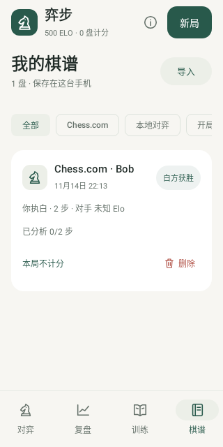 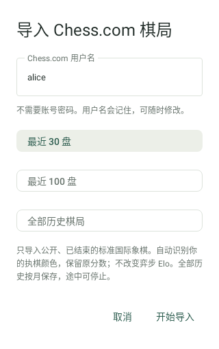

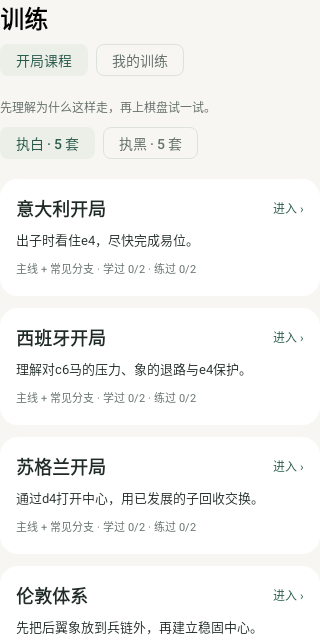 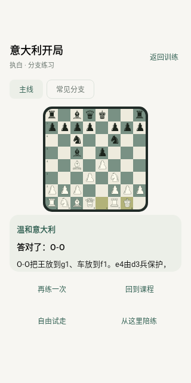

## 1.0.1 自动分析状态

| Before | After | Why |
| --- | --- | --- |
| 未打开的旧棋谱需要逐盘进入复盘 | 打开 App 后自动补齐全部棋谱；棋谱页显示剩余盘数和步数 | 批量导入后能直接等待，不需要重复操作 |
| 后台计算跟随当前页面，离开后取消 | 独立服务继续，通知显示进度，已完成结果逐步保存 | 切到其他 App 或锁屏后仍可处理 |
| 对局设置提供两种后台预算，容易误解自动复盘档位 | 简短说明统一使用极速分析，手动与最强对手优先 | 队列预算明确，避免批量分析误用长预算 |
| 没有整批任务的控制入口 | 一条浅色状态栏提供暂停/继续、显示通知与后台运行设置 | 保留列表空间，同时允许控制网络任务和系统限制 |

沿用原有绿色与字体，320dp 测试验证文字、剩余数量和操作可见。通知权限只在主动点击时申请；没有通知权限不阻止前台服务启动。通知频道为低重要性且无声音，避免每步分析触发提示。队列完成时只显示简短结果，隐藏任务控制；口令缺失时说明在对局设置填写。

## 1.0.2 互动开局教学

| Before | After | Why |
| --- | --- | --- |
| 默认阅读文字并连续点击下一步 | 一个目标、亲手走棋、即时解释、继续后看对手回应 | 让学习发生在棋盘上，并留下判断与消化的时间 |
| 棋盘限制为高度的 36%，最大 300dp | 与对弈界面相同的完整宽度、比例和边框 | 熟悉的格子大小便于点棋，不为文字缩小棋盘 |
| 讲解、分支、练习、试走和陪练同时争夺空间 | 主操作固定，路线具名选择；其他入口收进更多 | 每一步只需做当前目标，其他练法仍可找到 |
| 选错或看提示后直接结束，没有巩固机会 | 课末再练相关目标，并区分首次独立完成与辅助完成 | 让困难的部分得到一次额外练习，不对其他合法开局选择武断判坏棋 |
| 每套主线与一种分支，固定显示 2 条进度 | 每套 4 条具名路线，按实际数量显示进度，保留旧键 | 扩充内容不混淆学习记录，方便对比真实回应 |

沿用弈步的绿色、米白棋盘与原生落子动画。进度按目标完成变化；答后解释进入可见区域，主要动作固定在滚动区下方。没有自动走棋、倒计时、扣生命或额外 Elo。412dp 实际页面测量对弈/教学棋盘宽度一致，320dp 检查满宽棋盘、路线选择及作答后的可见操作。

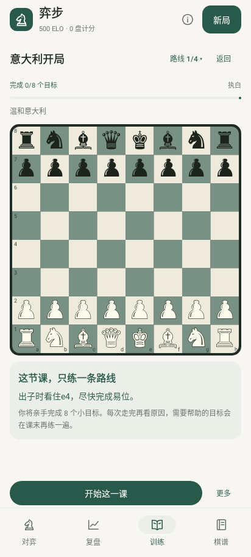 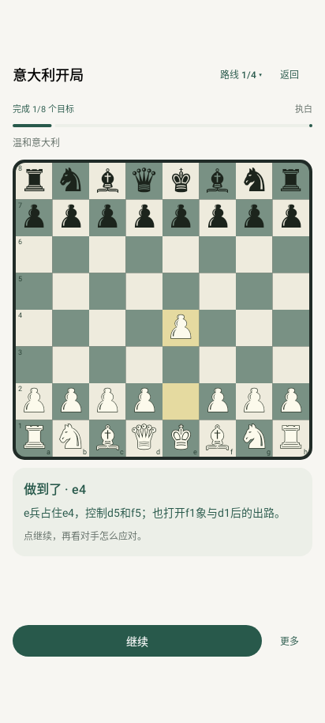

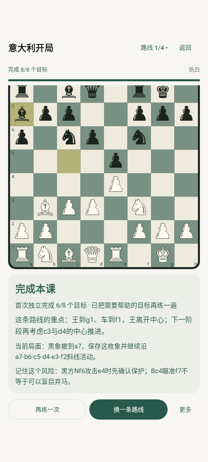 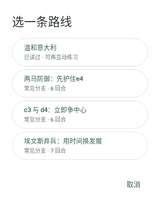

## 1.0.3 教学一屏与页面顶部

| Before | After | Why |
| --- | --- | --- |
| 四个页面都有弈步、Elo、信息和新局栏 | 只在对弈保留，其他三个页面直接进入内容 | 复盘、训练、棋谱获得更多空间 |
| 教学同时占用品牌栏和底部四页导航 | 课程使用专注布局，保留返回与路线入口；返回列表恢复导航 | 为完整大棋盘与当前讲解留足空间 |
| 大棋盘下方的目标、提示、解释需要上下滚动 | 固定棋盘，剩余空间放当前说明，底部固定主要操作 | 学习过程中不需要找文字，连续作答位置稳定 |
| 目标和操作说明在多个位置重复 | 每个阶段只显示当前目标、反馈或总结；答后原因全文保留 | 删去重复信息而非裁掉具体走棋原因 |
| 字号固定，小屏文字可能超出剩余空间 | 测量实际文字换行，从 14、13、12sp 选择能完整显示的正文大小 | 在常用手机与小屏下保持内容完整，优先保留棋盘尺寸 |

没有新增自动播放或推进。逐步讲解、自由试走、陪练与导入实战例子在“更多”中；路线选择对话框仍按名称列出四条路线。主要教学页面无滚动容器，提示与错误反馈不会移动棋盘。

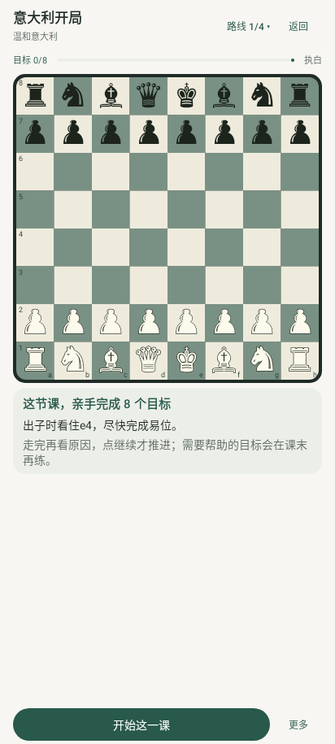 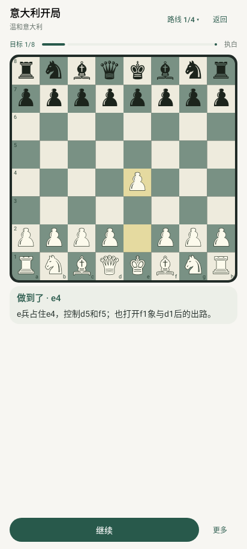

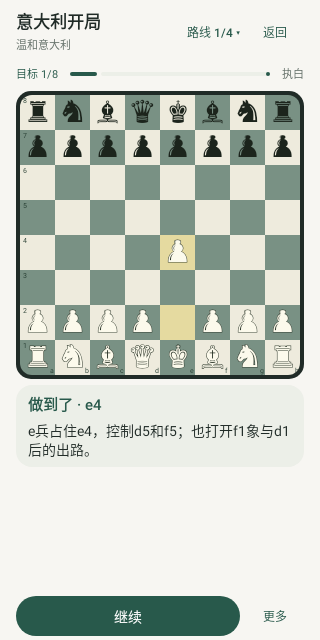 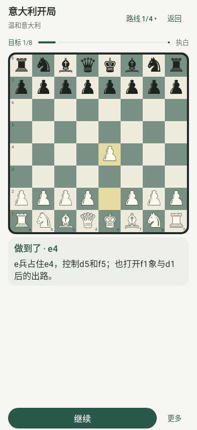
